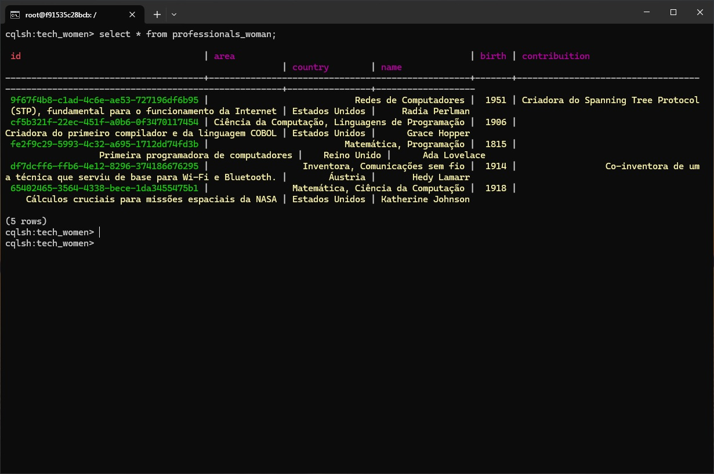

# Projeto Node.js com Cassandra

Este projeto implementa uma API Node.js que se conecta ao banco de dados Apache Cassandra para gerenciar informações sobre profissionais de tecnologia, com foco em mulheres que fizeram contribuições importantes na área.

## Requisitos

- [Node.js](https://nodejs.org/en/) (versão 14 ou superior)
- [Docker](https://www.docker.com/) (para rodar o Cassandra)
- [Postman](https://www.postman.com/) (ou outra ferramenta de API client)

## Passos para Rodar o Projeto

### 1. Clonar o Repositório

Primeiro, clone o repositório contendo o código-fonte do projeto e acesse a pasta.

  ```bash
  git https://github.com/arturbazza/tech_women.git

  cd tech_women
  ```

### 2. Instalar Dependências do Projeto Node.js

Inicialize um Projeto Node.js:
```bash
  npm init -y
  ```
Ainda no diretório do projeto, instale as dependências necessárias:
 ```bash
  npm install
 ```
### 3. Criando uma rede no docker com Windows conectar-se:
 ```bash
  docker network create cassandra-network
 ```
### 4. Rodar o cassanndra na rede que criamos acima:
   ```bash
  docker run --name cassandra --network cassandra-network -d cassandra
 ```
### 5. Ver as imagens no docker que está rodando (se necessário):
   ```bash
  docker ps
 ```
### 6. Inspeconar o Cassandra (se necessário):
 ```bash
  docker inspect cassandra
 ```
### 7. Listar as redes no Docker (se necessário):
   ```bash
  docker network ls
 ```
### 8. Isso vai iniciar o servidor na porta 3000.

### 9. Subir o Container Cassandra
#### Para rodar o banco de dados Apache Cassandra, utilize Docker:
 ```bash
  docker run --name some-cassandra -p 9042:9042 -d cassandra:latest
 ```
### 10. Conectar ao CQLSH e Configurar o Keyspace e a Tabela
#### Entre no container Cassandra e abra o CQLSH (interface do Cassandra para executar comandos SQL-like):
 ```bash
  docker exec -it some-cassandra cqlsh
 ```
### 11. Criando a estrutura e inserindo os dados na tabela
#### No CQLSH, execute os seguintes comandos para criar o keyspace e a tabela:

#### Criando BD:
 ```bash
  CREATE KEYSPACE IF NOT EXISTS tech_women
  WITH replication = {
    'class': 'SimpleStrategy',
    'replication_factor': 1
  };
 ```
#### Usando o BD:
 ```bash
  USE tech_women;
 ```
#### Criando tabela:
 ```bash
  CREATE TABLE IF NOT EXISTS professionals_woman (
    id UUID PRIMARY KEY,
    name text,
    birth text,
    country text,
    area text,
    contribution text
  )
 ```
#### Inserir os Dados Iniciais
#### Ainda no CQLSH, insira os dados das profissionais de tecnologia:
 ```bash
INSERT INTO professionals_woman (id, name, birth, country, area, contribution) 
VALUES (uuid(), 'Ada Lovelace', '1815', 'Reino Unido', 'Matemática, Programação', 'Primeira programadora de computadores.');

INSERT INTO professionals_woman (id, name, birth, country, area, contribution) 
VALUES (uuid(), 'Grace Hopper', '1906', 'Estados Unidos', 'Ciência da Computação, Linguagens de Programação', 'Criadora do primeiro compilador e da linguagem COBOL.');

INSERT INTO professionals_woman (id, name, birth, country, area, contribution) 
VALUES (uuid(), 'Hedy Lamarr', '1914', 'Áustria', 'Inventora, Comunicações sem fio', 'Co-inventora de uma técnica que serviu de base para Wi-Fi e Bluetooth.');

INSERT INTO professionals_woman (id, name, birth, country, area, contribution) 
VALUES (uuid(), 'Radia Perlman', '1951', 'Estados Unidos', 'Redes de Computadores', 'Criadora do Spanning Tree Protocol (STP), fundamental para o funcionamento da Internet.');

INSERT INTO professionals_woman (id, name, birth, country, area, contribution) 
VALUES (uuid(), 'Katherine Johnson', '1918', 'Estados Unidos', 'Matemática, Ciência da Computação', 'Cálculos cruciais para missões espaciais da NASA.');
 ```

### 12. Testar a API com Postman
#### Agora que o servidor está rodando, você pode testar a API utilizando o Postman ou outra ferramenta de API. As rotas disponíveis são:

  - GET /professionals: Retorna todas as profissionais cadastradas.

  - POST /professionals: Adiciona uma nova profissional. No corpo da requisição, envie um JSON com os seguintes campos:

 ```bash
      {
        "name": "Nome da Profissional",
        "birth": 1900,
        "country": "País",
        "area": "Área de Atuação",
        "contribution": "Contribuição"
      }
 ```
  - PUT /professionals/
Atualiza as informações de uma profissional existente. No corpo da requisição, envie os campos que deseja atualizar no mesmo formato do POST.

- DELETE /professionals/
Exclui uma profissional do banco de dados. Substitua :id pelo ID da profissional a ser removida.

### 13. Exemplo de Requisições no Postman:

#### GET Todas as Profissionais:

  - Método: GET
  - URL: http://localhost:3000/professionals

#### POST Adicionar uma Nova Profissional:

  - Método: POST
  - URL: http://localhost:3000/professionals
  - Body (JSON):
 ```bash
      {
        "name": "Margaret Hamilton",
        "birth": 1936,
        "country": "Estados Unidos",
        "area": "Engenharia de Software",
        "contribution": "Desenvolvimento do software de voo da Apollo."
      }
 ```
#### PUT Atualizar uma Profissional:

  - Método: PUT
  - URL: http://localhost:3000/divas/{id}
  - Body (JSON):
 ```bash
      {
        "area": "Engenharia de Software e Ciência da Computação"
      }
 ```
#### DELETE Remover uma Profissional:

  - Método: DELETE
  - URL: http://localhost:3000/divas/{id}


## Print Screem:

  

# Divirta-se! ;-)


